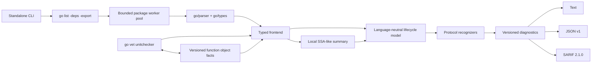

# Architecture

## Packages

| Package | Responsibility |
|---|---|
| `cmd/lifeline` | Detect standalone versus vet protocol and dispatch. |
| `analyzer` | `go/analysis` adapter, versioned function facts, categories, source-position indexing, and suggested edits. |
| `internal/standalone` | Package discovery, bounded parallel loading, export-data importer, type checking, flags, and exit policy. |
| `internal/frontend` | Typed Go recognition, lifecycle summaries, nested-function isolation, and lowering. |
| `internal/localssa` | Deterministic, narrow SSA-like instruction summary with canonical callees. |
| `internal/model` | Parser-independent spans, instructions, and lifecycle records. |
| `internal/engine` | Rule evaluation, assumptions, bounds, and CI policy matching. |
| `internal/report` | Buffered text, JSON, and SARIF rendering. |
| `internal/config` | Strict JSON and flat YAML/TOML configuration plus shared CLI list parsing. |

## Standalone loading

The command invokes `go list -deps -export -json -e` with an argument array, never shell interpolation. Build selection, module replacements, vendoring, and tags are delegated to the Go command. Export files are used by `go/importer`; target package source is parsed and type-checked locally.

Root packages are sorted by import path, analyzed by a worker pool bounded by `GOMAXPROCS`, and reassembled in the original sorted order. The export-file map is immutable during worker execution. A first loading or analysis error cancels remaining work. Timeout paths retain completed diagnostics and label the report incomplete; invalid package/type errors remain hard input failures.

Dependencies are loaded for export data. With `-tests`, same-package test files are appended to the package; external `_test` packages remain a documented limitation.

## Vet mode and facts

The executable recognizes unitchecker protocol invocations and delegates to `golang.org/x/tools/go/analysis/unitchecker`.

For every analyzed named function, the analyzer exports a versioned object fact containing only its conservative body lifecycle summary:

- unconditional-loop presence;
- return evidence;
- context-stop evidence;
- channel-stop evidence;
- configured explicit-stop evidence.

A direct cross-package goroutine target may import this fact. Facts with an incompatible semantic version are ignored and treated as unavailable. Package-wide facts were removed because they were too coarse to connect safely to a particular call site.

## Frontend passes

For each function within `max_functions`, the frontend performs:

1. one definition pass for context-cancel bindings and join groups;
2. one combined pass for body lifecycle, ownership uses, and goroutine starts;
3. one SSA-like instruction pass.

Nested function literals have separate lifecycle boundaries. The combined pass may traverse them to observe uses of outer values and discover inner goroutine starts, but their loops and exits are excluded from the enclosing body's lifecycle summary.

Wrapper names are compiled into maps once per package. Object-use sets are collected once per relevant call or subtree instead of rescanning once per tracked cancel/group object.

## Internal API boundary

The engine imports neither `go/ast` nor `go/types`. All parser-specific reasoning is confined to the frontend and local SSA builder. The model contains source spans rather than AST node identities, allowing deterministic engine tests and leaving room for a future alternative frontend or full-SSA backend.

## Caching

Lifeline 0.1.1 has no application-managed result cache. This avoids accepting stale summaries before source, dependency, toolchain, configuration, and backend digests can be represented safely. Vet object facts carry a semantic version and incompatible facts are rejected.

If a persistent cache is added, its key must include tool/fact versions, Go toolchain identity, build configuration, source and dependency digests, effective configuration, and backend mode.
