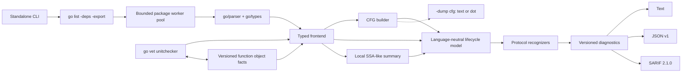

# Architecture

The dotted edge is deliberate: `-dump cfg` calls `internal/cfg` directly, with no trust predicate and outside the normal pipeline, purely to show the structural graph. The solid edges show the path an actual diagnostic (`LL1002`) takes: the frontend builds a CFG per goroutine body (with its trust predicate applied) and attaches it to the model, which `internal/engine` reads via `model.CFG`'s own graph algorithms — without needing to import `go/ast` or `go/types` itself, since `model.CFG` carries no parser dependency. See "Control-flow graph" below.

## Packages

| Package | Responsibility |
|---|---|
| `cmd/lifeline` | Detect standalone versus vet protocol and dispatch. |
| `analyzer` | `go/analysis` adapter, versioned function facts, categories, source-position indexing, and suggested edits. |
| `internal/standalone` | Package discovery, bounded parallel loading, export-data importer, type checking, flags, exit policy, `-dump cfg`, and `-dump facts`. |
| `internal/frontend` | Typed Go recognition, lifecycle summaries, nested-function isolation, lowering, and CFG construction (with a trust predicate) for each goroutine body. |
| `internal/localssa` | Deterministic, narrow SSA-like instruction summary with canonical callees. |
| `internal/cfg` | Control-flow graph construction and text/DOT rendering from a typed AST body, given an optional trusted-terminator predicate. See "Control-flow graph" below. |
| `internal/model` | Parser-independent spans, instructions, lifecycle records, CFG types plus their graph algorithms (`Reachable`, `CanReach`, `SCCs`), and the generic dataflow worklist solver (`Solve`). |
| `internal/engine` | Rule evaluation (including CFG/SCC-based `LL1002` verdicts, `cfg_verdict.go`), Phase 3 dataflow lattices (`dataflow_lattices.go`), assumptions, bounds, and CI policy matching. |
| `internal/report` | Buffered text, JSON, and SARIF rendering. |
| `internal/config` | Strict JSON and flat YAML/TOML configuration plus shared CLI list parsing. |

## Standalone loading

The command invokes `go list -deps -export -json -e` with an argument array, never shell interpolation. Build selection, module replacements, vendoring, and tags are delegated to the Go command. Export files are used by `go/importer`; target package source is parsed and type-checked locally.

Root packages are sorted by import path, analyzed by a worker pool bounded by `GOMAXPROCS`, and reassembled in the original sorted order. The export-file map is immutable during worker execution. A first loading or analysis error cancels remaining work. Timeout paths retain completed diagnostics and label the report incomplete; invalid package/type errors remain hard input failures.

Dependencies are loaded for export data. With `-tests`, same-package test files are appended to the package; external `_test` packages remain a documented limitation.

## Vet mode and facts

The executable recognizes unitchecker protocol invocations and delegates to `golang.org/x/tools/go/analysis/unitchecker`.

For every analyzed named function, the analyzer exports a versioned object fact containing only its conservative body lifecycle summary:

- unconditional-loop presence;
- return evidence;
- context-stop evidence;
- channel-stop evidence;
- configured explicit-stop evidence.

A direct cross-package goroutine target may import this fact. Facts with an incompatible semantic version are ignored and treated as unavailable. Package-wide facts were removed because they were too coarse to connect safely to a particular call site.

## Frontend passes

For each function within `max_functions`, the frontend performs:

1. one definition pass for context-cancel bindings and join groups;
2. one combined pass for body lifecycle, ownership uses, and goroutine starts;
3. one SSA-like instruction pass.

Nested function literals have separate lifecycle boundaries. The combined pass may traverse them to observe uses of outer values and discover inner goroutine starts, but their loops and exits are excluded from the enclosing body's lifecycle summary.

Wrapper names are compiled into maps once per package. Object-use sets are collected once per relevant call or subtree instead of rescanning once per tracked cancel/group object.

## Internal API boundary

The engine imports neither `go/ast` nor `go/types`. All parser-specific reasoning is confined to the frontend, the local SSA builder, and the CFG builder. The model contains source spans rather than AST node identities, allowing deterministic engine tests and leaving room for a future alternative frontend or full-SSA backend.

## Control-flow graph

`internal/cfg` builds a parser-independent `model.CFG` (explicit basic blocks and edges: `if`/`for`/`range`/`switch`/`select` branches, loop back-edges, `break`/`continue`/`goto` resolved to their actual targets under Go's own scoping rules, `return`/`panic` routed to a function's exit block, plus a `trusted-stop` edge for a call `internal/frontend` has decided to trust as terminating even though it is not itself visible in pure control flow — a configured stop-wrapper call, or a tracked context passed to a called operation) from the same typed AST the frontend already walks.

This replaced `internal/frontend`'s flat, body-wide "does this contain a return/break/select-with-ctx.Done() anywhere" boolean summaries with true reachability over an explicit graph, for `LL1002`. The flat summaries could be — and were, prior to loop-scoping added in an earlier release — wrong in a specific, demonstrable way: evidence found anywhere in a goroutine body could suppress a finding about a completely unrelated loop in the same body. Loop-scoping closed the common cases of that class of bug without a graph; one case remained structurally unfixable without one: a goroutine with two separate unconditional loops where only one has its own exit still cleared the finding for both, because exit status was tracked per goroutine, not per loop. `internal/engine/cfg_verdict.go` closes this: `LL1002` now fires when a goroutine's CFG contains a reachable, persistent (cyclic) strongly-connected component with no edge leaving it that can reach the function's exit, with each such component judged independently. `tests/differential/cfg_ast_test.go` holds the exact former gap as a fixed regression fixture (`TestFixed_NestedLoopsMixedResolution`), verified both directly against the CFG and against the full engine.

This is wired for a same-package or closure target (a body to build a CFG from) but not universally: a cross-package goroutine target resolved through a `go vet` fact has no body of its own to build one from. As of `FunctionFact.LoopUnresolved` (fact schema version 3, `analyzer/analyzer.go`, Phase 4), the exporting package computes and exports `internal/engine.UnresolvedLoop` for its own function's CFG alongside the prior flat booleans; the importer trusts that exported verdict directly (`model.Goroutine.ImportedUnresolvedLoop`) rather than falling back to the flat evidence check. `tests/testdata/facts/mixed_consumer` and `TestVetCrossPackageFactCatchesMixedResolutionLoop` hold the cross-package mixed-resolution case (the same shape `TestFixed_NestedLoopsMixedResolution` covers for a same-package/closure target) as a fixture: this really was a false negative under the old flat-boolean-only fact format, since the fact only had one shared `HasReturn` per function, and the inner loop's break flattened into it, wrongly clearing the outer loop's finding. `LL1001` still reads no CFG or fact at all. `LL1003`/`LL1004`/`LL1005` do now, but not via this same-package-vs-cross-package fact machinery: Phase 6 (`docs/cfg-migration-plan.md`) gave `internal/frontend.computeGroupOrdering` its own, separate, purely structural CFG per function (built fresh with a `nil` trust predicate, deliberately not reusing `fn.BodyLifecycle.CFG` — see that section for why) and a new `model.CFG.ReachableAvoiding` primitive, entirely same-function; there is no cross-package extension of it, so a `go vet` fact still carries nothing for join/stop ordering.

Inspect a CFG directly with `lifeline -dump cfg [-dump-format text|dot] ./...`. This walks every named function and every nested function literal (goroutine bodies overwhelmingly being the latter) and bypasses the normal diagnostic pipeline entirely — it is a development aid, not a report format, applies no `ignore_paths`/generated-file filtering, and (unlike the CFG `LL1002` actually uses) is built with no trust predicate, so it never shows a `trusted-stop` edge.

## Dataflow (Phase 3)

`internal/model/dataflow.go`'s `Solve` is a generic forward-dataflow worklist solver over `model.CFG`: given a join-semilattice type, a transfer function, and a join function, it iterates each block's in-state (the join of its predecessors' out-states) to a fixed point, re-queuing successors whenever a block's out-state changes. This exists because a "has this happened yet, on any path to here" fact — has a value's ownership transferred, has a join obligation been satisfied — cannot be computed correctly by a single forward pass when the CFG has a cycle: a fact established partway through a loop body must still be visible at the header once the loop's back-edge carries it around, which needs revisiting blocks, not visiting each one once. (Its first implementation had exactly this class of bug — computing "changed" relative to a bottom value that happened to coincide with the first real computed value — caught by `internal/model/dataflow_test.go`'s loop-propagation test before anything was built on top of it.)

`internal/engine/dataflow_lattices.go` defines three lattices on top of `Solve`, per `docs/cfg-migration-plan.md`'s Phase 3 list: `StopCapability` (None/Available/ProvenConsumed), `JoinObligation` (None/Required/Satisfied/Escaped), `Ownership` (Local/Transferred/Unknown). All three share a `pointTransfer` shape: once a block matching some predicate is reached on a path, the state becomes resolved and stays resolved from there on, matching Lifeline's existing philosophy elsewhere in the codebase that evidence of resolution on any one path is credited, not required on every path. Only `StopCapability` is wired to a real predicate derived from CFG structure alone (a block's own outgoing edges: a trusted-stop, a return, or a panic — deliberately a local check, not `CanReach`, which would mark every branch of a select loop "resolved" just because a sibling branch happens to return). `JoinObligation` and `Ownership` are demonstrated only against synthetic fixtures for now; wiring them to real bindings needs the same kind of frontend-supplied trust predicate Phase 2 built (`internal/frontend`'s `trustedTerminator`), not yet built for these two dimensions. The real-world verification gap they were meant to eventually close — is a WaitGroup/errgroup actually joined, and joined in the right order relative to its workers' stop signal — was instead closed by Phase 6 (`docs/cfg-migration-plan.md`) via a different, more direct mechanism: `model.CFG.ReachableAvoiding` (block reachability with a set of blocks treated as deleted) answers "does every path pass through X" and "is Y reachable only after X" directly, without needing a forward-dataflow lattice at all — those two questions turned out not to fit the generic monotone-lattice shape noticeably better than a direct graph check does. "Worker exit state" (termination), the fourth item in Phase 3's list, is deliberately not reimplemented here: it is naturally a backward question ("can this point reach Exit"), which Phase 2's SCC/reachability analysis (`internal/engine/cfg_verdict.go`) already answers correctly — recomputing it via forward propagation would be redundant at best.

Inspect computed facts with `lifeline -dump facts [-dump-format text|json] ./...`, per `docs/cfg-migration-plan.md` §8.2. Per worker (goroutine): `stop` (available/consumed, from `StopCapability`), `termination` (exit-reachable and each persistent SCC's resolved status, from `internal/engine.SummarizeTermination`, the same computation `LL1002`'s verdict is derived from), and `join` (currently always `"analyzed": false` with an explanatory note, being honest about what isn't wired yet rather than showing fabricated data). Like `-dump cfg`, this bypasses the diagnostic pipeline and applies no file filtering.

No diagnostic verdict was changed by any of this: `LL1002` still uses only `cfg_verdict.go` (Phase 2), and no other rule reads a CFG or a dataflow result at all.

## Caching

Lifeline 0.1.1 has no application-managed result cache. This avoids accepting stale summaries before source, dependency, toolchain, configuration, and backend digests can be represented safely. Vet object facts carry a semantic version and incompatible facts are rejected.

If a persistent cache is added, its key must include tool/fact versions, Go toolchain identity, build configuration, source and dependency digests, effective configuration, and backend mode.
